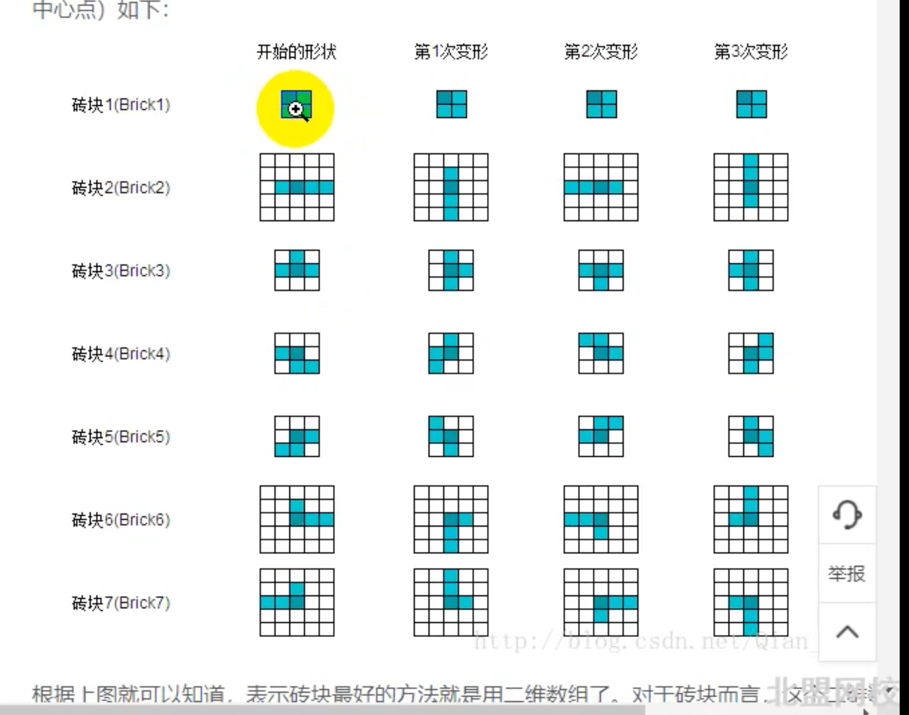

# TS版本的俄罗斯方块 基于渡一教育的TS进阶课

# 整体设计规划
## 单一职能原则
每个类只做与他相关的一件事
## 开闭原则
类只对扩展开放，对修改关闭
## 数据-界面分离
属性私有化，通过公开get set的方式进行暴露

# 方块类的设计要点
方块类有两个重要的属性：坐标和展示

坐标需要注意是抽象的逻辑坐标，与具体页面展示的无关（UI与逻辑分开）

如果修改页面UI，只需要修改UI层，无需改动抽象块的逻辑。

其次是对控制展示的接口的抽象，square类只依赖接口，但不依赖具体的实现，具体的实现由具体的使用者来控制。

通过对selfViewer的再次抽象，来对viewer进行控制接口的实现，但是又避免了与square类的耦合。
例如我在div中使用square类，我需要在div对应的组件内定义viewer的实现逻辑，并且也需要满足我已经定义好的selfViewer抽象接口。
当我在canvas中使用square类时，也需要做类似的操作。
这样做的好处是viewer视图层的逻辑与viewer解耦。

# 方块类在pageview的显示逻辑
这块内容花费了两个小时有余的时间，主要是原课程中使用jQuery进行实现，展示逻辑和selfViewer的逻辑在同一个地方。
而在vue中 selfviewer类在一个文件中，具体的组件实现逻辑在vue文件中，且需要注意数据的同步问题：对square的操作需要改为响应式的，这里涉及vue的相关声明。

这节的主要逻辑依然为对SquarePageViewer的具体实现

首先使用implements按照selfViewer的约束进行实现，SquarePageViewer内部主要为了完成展示和移除两个功能，不过具体的实现是在 vue 组件内部。

vue组件内部的实现逻辑是定义一个map，add时就加入到map中，删除时同理。

通过compued监听map并生成对应的array，通过page-viewer config来吧逻辑坐标转化为真实坐标。

# 方块组合
方块组合为新增的一个类，类使用定义好的针对中心点的相对坐标。

对方块的移动实际上都是对组合的移动，并且组合的移动会同步更新到每个方块的坐标上。

# 俄罗斯方块规则类

新创建一个方块类，主要实现触底判断、移动、旋转的功能。

触底判断的思路是给定一个目标的坐标，将方块的坐标按照给定目标设置后，对宽高和数值进行判断

#Vue与响应式遇到的问题

在做规则类的时候发现使用规则类对俄罗斯方块进行移动变形时 UI没有及时的刷新，粗略看下代码可以修改的是逻辑层的坐标.
所以重构了下page-viewer层的代码。

这里也重新理一下目前到方块规则层的逻辑。

第一个类是square类，定义了整个俄罗斯方块的基础小方块，包括坐标，颜色的信息。同时定义了显示UI层的接口，包含了show和remove。UI层在这个接口的约束下实现。

第二类是square-group类，因为俄罗斯方块涉及到对某个块的消除，所以最小逻辑为方块，二square-group则是方便实现游戏定义的第二个类。

它包含了形状类型（俄罗斯方块的几种类型），形状的坐标，基于这个坐标可以计算出每个块的坐标，而针对方块的移动，变形都是基于square-group类。

随后使用vue的html来进行UI层的实现，

ui层分为两部分，一部分是对接口的实现，另一部分是具体的逻辑。

通过对组件的ref的引用，来调用具体组件中对UI的实现逻辑。（我觉得可以再抽象一层为钩子函数，将代码进行实现）

创建时创建了逻辑层的俄罗斯方块，然后调用show方法，将逻辑层的方块展示到UI层；

移动修改俄罗斯方块时，现在逻辑层做判断和修改，最后再调用UI层的方法通知UI进行修改。

重新对尔罗斯方块的中心点进行规划。如果选用左上角作为起点进行旋转逻辑时比较困难 

中心点的选择标准是每次旋转都固定不变的一个点

ts类的几个关键字什么意思？
static
pravite
public
protected

/**
建议用法

- 单一渲染入口：把现在的 viewerRef.updateAll(teris.squares) 收敛为一个统一的 render(teris) 或事件订阅，减少散落的手动同步点。
- 事件驱动同步：逻辑层在移动/旋转后触发 changed 事件；视图层订阅后做 updateAll 或增量更新，保持 UI/逻辑彻底解耦。
- 增量更新：旋转与移动返回“脏方块列表”，UI只更新变化的条目，性能更好。
- 响应式桥梁（可选）：如果未来你希望彻底去掉显式 updateAll ，可把“逻辑快照”映射到一个 reactive 的视图模型，由 watchEffect 驱动。
总结：在你的俄罗斯方块项目里，Vue 让“UI-逻辑分离”变得自然且高效：逻辑保持纯净，视图用声明式和响应式的小而准的更新去跟随状态，维护和扩展都会轻松不少；相对于 jQuery 的命令式和 React 的粗粒度 diff，Vue 的细粒度依赖追踪更贴合“格子坐标频繁更新”的问题形态。
 */